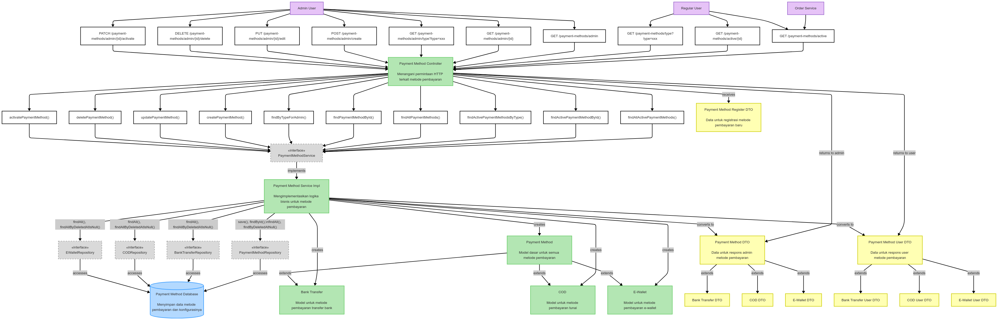
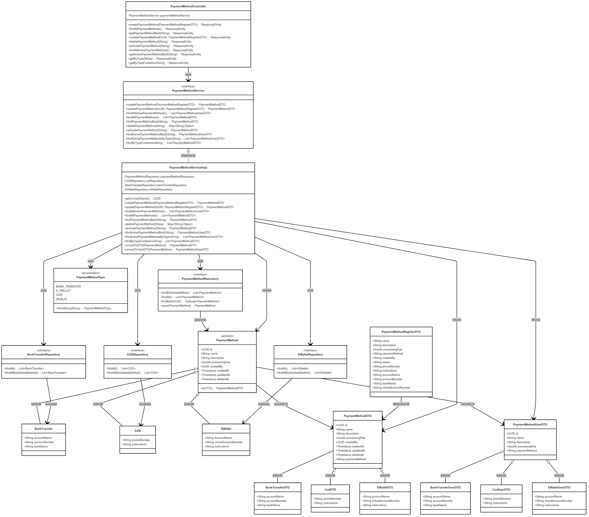
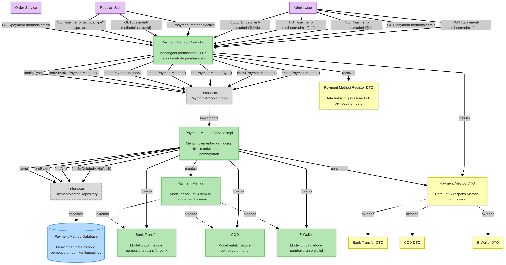
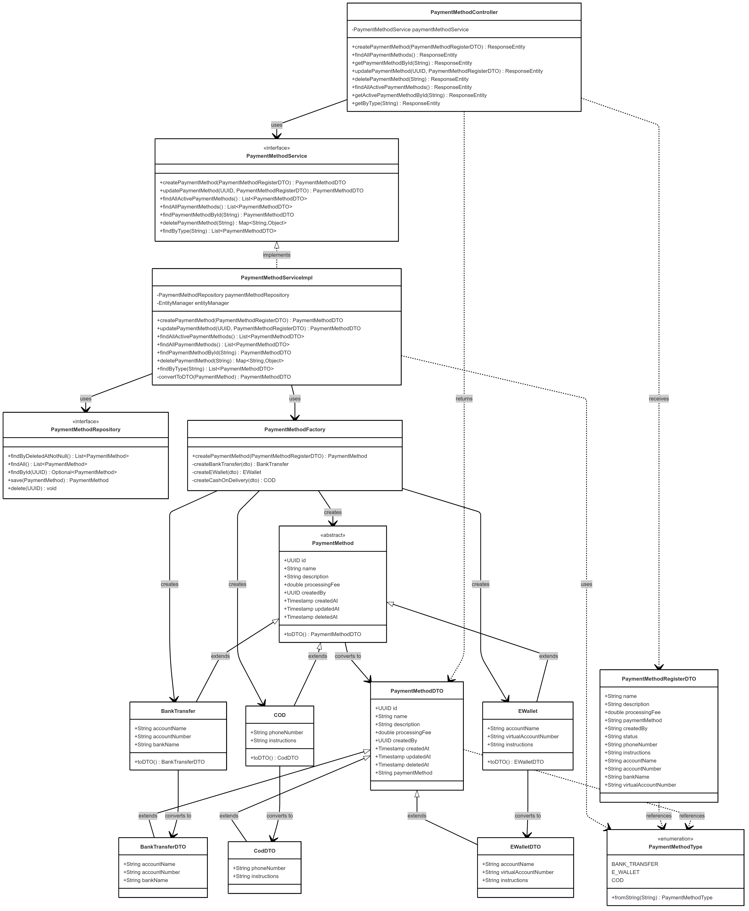
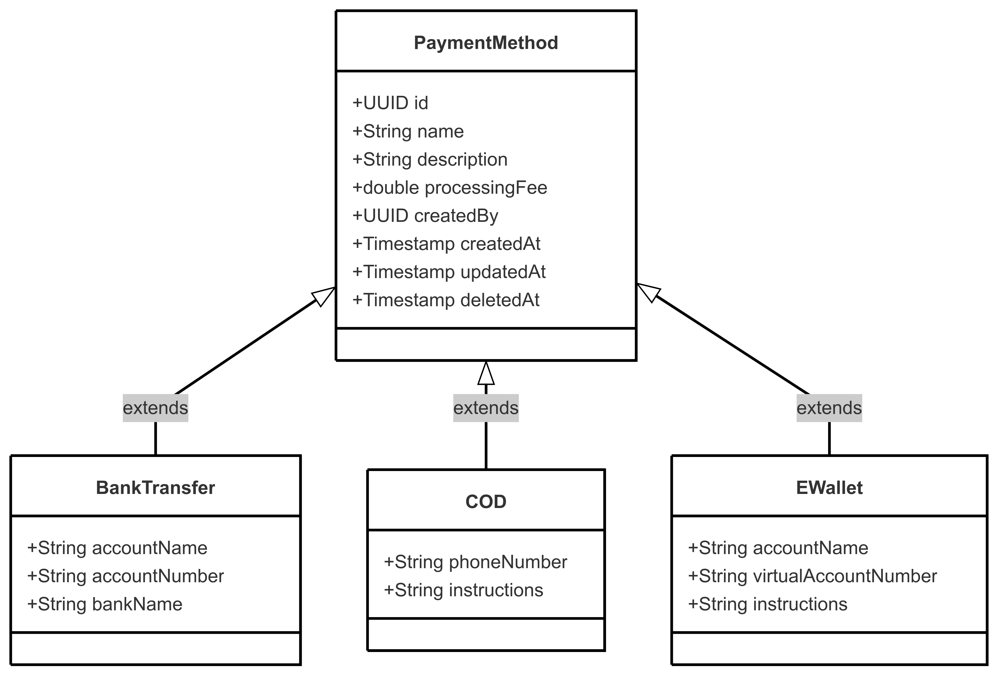
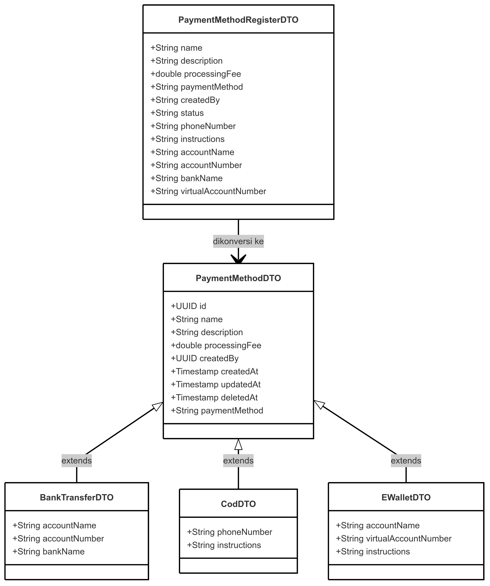
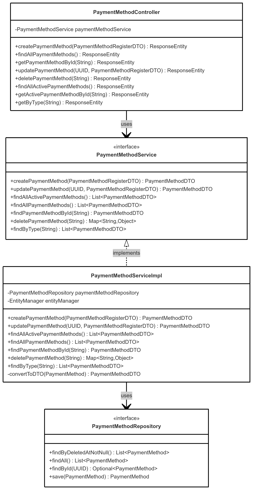
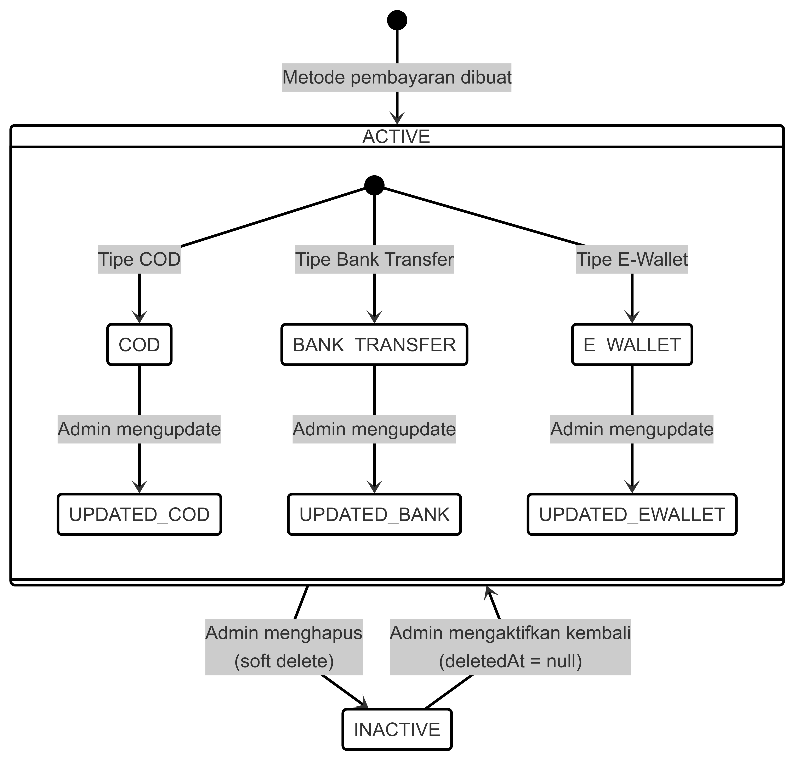
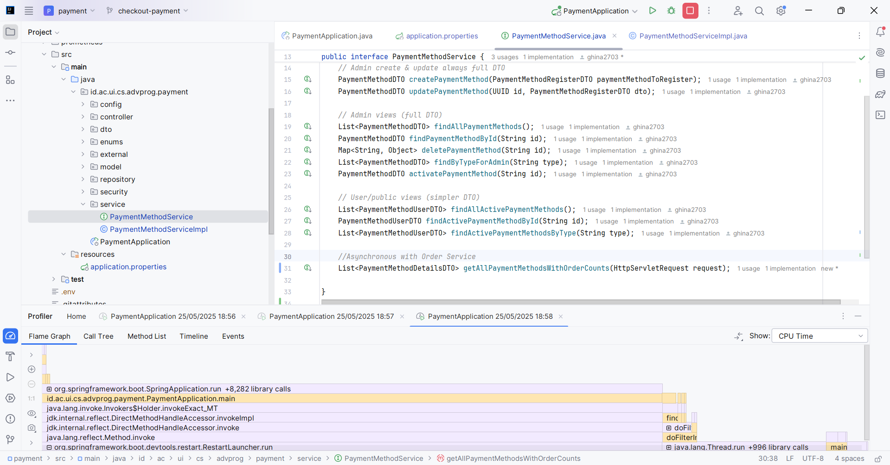

**Nama: Ghina Nabila Gunawan**

**NPM: 2206825914**

**Kelas: AdvProg - A**

---

### 💲Software Architecture Payment Management Service - Updated💲

### Component Diagram untuk Payment Management Service - Updated

### Code Diagram untuk Payment Management Service - Updated

---

### 💲Software Architecture Payment Service💲

### Component Diagram Payment Management Service

**Aktor (Ungu)**

- **Admin User**: Pengguna dengan hak akses admin yang dapat melakukan operasi CRUD pada payment method
- **Regular User**: Pengguna biasa yang hanya dapat melihat payment method aktif
- **Order Service**: Layanan eksternal yang menggunakan payment method untuk pemrosesan pesanan

**Controller (Hijau)**
- **Payment Method Controller**: Menangani semua HTTP request terkait payment method, dengan endpoint terpisah untuk admin dan pengguna biasa

**Interface (Abu-abu)**
- **PaymentMethodService**: Interface yang mendefinisikan kontrak untuk layanan payment method
- **PaymentMethodRepository**: Interface untuk akses data payment method

**Service (Hijau)**

- **Payment Method Service Impl**: Implementasi dari interface PaymentMethodService yang berisi logika bisnis untuk pengelolaan payment method

**Model (Hijau)**

- **Payment Method**: Model dasar untuk semua jenis payment method
- **Bank Transfer**: Model untuk payment method transfer bank
- **COD**: Model untuk payment method tunai (Cash On Delivery)
- **E-Wallet**: Model untuk payment method e-wallet

**DTO (Kuning)**

- **Payment Method Register DTO**: Data Transfer Object untuk registrasi payment method baru
- **Payment Method DTO**: DTO dasar untuk respons payment method
- **Bank Transfer DTO**, **COD DTO**, **E-Wallet DTO**: DTO spesifik untuk setiap jenis payment method

**Database (Biru)**

- **Payment Method Database**: Menyimpan data payment method dan konfigurasinya

---

### Code Diagram

**Code Diagram 1: Inheritance Hierarchy Payment Method**

Diagram ini menunjukkan hierarki inheritance untuk model payment method. `PaymentMethod` adalah class dasar yang memiliki properti umum seperti id, nama, dan deskripsi. Class turunan seperti `BankTransfer`, `COD`, dan `EWallet` memperluas class dasar dengan properti khusus untuk setiap jenis payment method.

**Code Diagram 2: DTO Pattern untuk Payment Method**

Diagram ini menggambarkan pola Data Transfer Object (DTO) yang digunakan untuk pertukaran data antara lapisan dalam sistem. `PaymentMethodDTO` adalah class dasar untuk DTO, dengan class turunan seperti `BankTransferDTO`, `CodDTO`, dan `EWalletDTO` untuk jenis payment method spesifik. `PaymentMethodRegisterDTO` digunakan untuk menerima data dari klien saat membuat atau memperbarui payment method.

**Code Diagram 3: Controller dan Service Interface**

Diagram ini menunjukkan hubungan antara controller, service interface, service implementation, dan repository. `PaymentMethodController` menangani HTTP request dan memanggil `PaymentMethodService`. `PaymentMethodServiceImpl` mengimplementasikan interface `PaymentMethodService` dan menggunakan `PaymentMethodRepository` untuk akses data.

**Code Diagram 4: Status Metode Pembayaran**

Diagram status menggambarkan siklus hidup payment method, termasuk status ACTIVE dan INACTIVE (soft delete). Dalam status ACTIVE, payment method dapat memiliki berbagai tipe (COD, BANK_TRANSFER, E_WALLET) dan dapat diperbarui oleh admin.

---

### 💲Progress Milestone Payment Service💲

| Komponen                                                                                                     |
|--------------------------------------------------------------------------------------------------------------|
| **Software Design** (SOLID Principles, Maintainability, Design Patterns)                                     | 
| **Software Quality** (Clean Code, Secure Coding, Testing, Profiling)                                         |
| **Software Architecture** (Architecture, Concurrency, Asynchronous, High Level Networking)                   |
| **Software Deployment** (CI/CD, Deployment Strategies, Containerization, Monitoring, Infrastructure as Code) |

---

📌 **Progress Milestone 50%**

> Pada milestone 50% ini, saya telah mengerjakan dan menguji pada Postman seluruh fitur utama dari `PaymentMethod`, termasuk seluruh endpoint untuk operasi CRUD dengan dukungan role-based access. Salah satu yang terpenting yaitu penerapan **High-Level Networking** menggunakan protokol **HTTP-based RESTful API** yang memfasilitasi komunikasi antara frontend dan backend. Implementasi ini mendukung komunikasi client-server yang stabil dan aman. 

---

📌 **Progress Milestone 25%**:

> Pada milestone 25% ini, saya telah mengerjakan pondasi utama untuk fitur `PaymentMethod`, mencakup model, controller, service, DTO, repository, dan juga enum untuk tipe payment method. Selain itu, telah dilakukan integrasi dengan service Authentication untuk otorisasi berbasis JWT, serta penerapan role-based security pada endpoint menggunakan anotasi @PreAuthorize dan @PermitAll. 
> Dari sisi DevOps, pipeline CI/CD awal telah diterapkan menggunakan GitHub Actions untuk otomatisasi build dan deployment ke EC2. 

---

#### 1. **Software Design 🛠️**

**SOLID Principles ✅**
- **Single Responsibility Principle (SRP)**: Kode yang dibuat sudah mengikuti prinsip ini, seperti controller yang hanya menangani request dan response, service yang menangani business logic, dan model yang merepresentasikan data.
- **Open/Closed Principle (OCP)**: Sudah mengimplementasikan interface seperti `PaymentMethodService` yang memudahkan penambahan payment method baru tanpa mengubah kode yang ada.
- **Liskov Substitution Principle (LSP)**: Penggunaan inheritance dengan `PaymentMethod` sebagai superclass dan `COD`, `BankTransfer`, dan `EWallet` sebagai subclass sudah sesuai dengan prinsip ini.
- **Interface Segregation Principle (ISP)**: Interface yang digunakan sudah tersegmentasi, seperti `PaymentMethodService` yang hanya punya method yang relevan untuk class yang mengimplementasikannya.
- **Dependency Inversion Principle (DIP)**: Menggunakan dependency injection melalui anotasi `@Autowired` yang memisahkan antara komponen tinggi (controller/service) dengan komponen rendah (repository).

**Maintainability 🧰**
- **Separation of Concerns**: Controller hanya menangani request/response, service menangani logika bisnis, dan repository yang berhubungan dengan database. 
- **Modularisasi**: Sudah cukup modular dengan penggunaan DTO untuk memisahkan data yang dikirim ke dan dari client, serta menggunakan Factory Pattern untuk pembuatan objek yang berbasis tipe pembayaran.
- **Readability**: Sudah cukup readable, tapi mungkin kedepannya akan diberikan komentar atau dokumentasi supaya lebih clear.
- **Testability**: Sudah terdapat unit tests yang menguji controller dan service, memastikan bahwa perubahan atau penambahan fitur tidak merusak fungsionalitas yang ada.

**Design Patterns 🎨**
- **DTO (Data Transfer Object)**: Diimplementasikan dalam pembuatan objek `PaymentMethod` berdasarkan jenis pembayaran, seperti `COD`, `BankTransfer`, dan `EWallet`.
    > Alasannya, karena menurut saya, menggunakan DTO itu akan memudahkan dalam mengelola data yang dikirim antara app layer (seperti dari controller ke service atau sebaliknya). Dengan DTO, saya bisa memisahkan bussiness logic dari data representation yang digunakan oleh client (misalnya, frontend). Jadi kalau ada yang ingin mengambil API bisa langsung transfer object nya.

- **Factory Pattern**: Diterapkan pada jenis-jenis pembayaran, memungkinkan penambahan metode pembayaran baru dengan mudah tanpa merubah kode yang ada.
    > Saya memilih menggunakan Factory Pattern untuk menyederhanakan pembuatan objek-objek, terutama pada bagian PaymentMethod yang punya berbagai tipe. Factory Pattern memungkinkan aplikasi untuk menangani variasi tipe objek (misalnya BankTransfer, EWallet, dan COD) tanpa harus membuat objek secara langsung di banyak tempat.

---

#### **Software Quality 🏆**

**Clean Code 💡**
- **Separation of Concerns**: Kode sudah memisahkan antara logic request/response di controller, bisnis di service, dan data di model.
- **Naming Conventions**: Nama variabel dan method yang digunakan sudah cukup jelas dan menggambarkan fungsinya. Contoh: `createPaymentMethod`, `getPaymentMethodById`, dll.
- **Readability**: Kode sudah cukup bersih dan mudah dibaca. 

**Secure Coding 🔒**
- **Input Validation**: Saat ini, input dari pengguna seperti di `PaymentMethodRegisterDTO` perlu divalidasi untuk memastikan data yang masuk tidak menyebabkan kerentanannya, misalnya menggunakan anotasi validasi seperti `@NotNull`, `@Size`, atau `@Email`.
- **Access Control**: Sudah diterapkan menggunakan anotasi `@PreAuthorize("hasRole('ADMIN')")` dan `@PermitAll`, membatasi akses berdasarkan peran pengguna.
- **JWT Authentication**: Sudah digunakan untuk autentikasi dan kontrol akses. Saya akan memastikan lagi kalau token selalu diverifikasi dengan benar untuk mencegah masalah terkait keamanan.

**Testing 🧪**
- **Unit Testing**: Sudah dilakukan untuk memastikan bahwa controller dan service berfungsi sebagaimana mestinya. Tapi masih bisa ditambah lebih banyak edge case dan skenario error yang perlu diuji.
- **Mocking**: Sudah menggunakan mocking (`Mockito`) untuk memastikan bahwa unit tests tidak bergantung pada implementasi yang lebih besar, seperti database.
- **Test Coverage**: Masih bisa ditambahkan lebih banyak jalur yang mungkin (misalnya validasi input yang salah, kesalahan autentikasi) dan memastikan kode bisa diubah tanpa merusak fungsionalitas yang ada.

**Profiling**:

Pada tahap profiling, saya menggunakan fitur IntelliJ Profiler untuk menganalisis performa aplikasi PaymentApplication. Profiling dilakukan dengan menjalankan aplikasi dalam mode profiler di IntelliJ sehingga dapat merekam aktivitas CPU, memori, serta panggilan metode secara detail selama aplikasi berjalan.
Profiling menghasilkan visualisasi seperti Flame Graph yang menunjukkan waktu CPU yang digunakan oleh setiap metode, sehingga dapat diidentifikasi bagian-bagian kode yang paling berat atau sering dipanggil. Dari hasil profiling ini, terlihat bahwa metode utama yang menjalankan logika bisnis aplikasi mendapat alokasi waktu CPU yang signifikan, namun terdapat beberapa metode library dan framework yang juga memberikan beban pemrosesan.

- Fokus pada metode dalam package aplikasi yang paling banyak menggunakan CPU. Refaktor atau optimasi algoritma untuk mengurangi beban CPU.

- Jika ditemukan metode dari framework yang menjadi bottleneck, pertimbangkan konfigurasi ulang atau gunakan caching untuk mengurangi pemanggilan berulang.

- Perhatikan penggunaan thread dan blocking calls yang dapat menyebabkan bottleneck, optimasi dengan asynchronous processing jika memungkinkan.

- Integrasikan dengan monitoring runtime (misalnya Prometheus + Grafana) untuk melihat performa dalam kondisi beban nyata dan menemukan potensi bottleneck lainnya.

---

#### 3. **Software Architecture 🏗️**

**Architecture 🏗️**
- Sudah mengadopsi arsitektur yang terpisah dengan controller, service, dan repository (**modularity**). Ini membuat aplikasi lebih mudah dikelola dan dikembangkan.

**Concurrency 🔀**
- Implementasi concurrency dasar telah diterapkan pada service pengambilan detail payment method. Penggunaan `ExecutorService` bersama `CompletableFuture` memungkinkan pemrosesan I/O-bound task (seperti panggilan ke service lain) secara asynchronous, memanfaatkan thread pool untuk efisiensi.

**Asynchronous ⏳**
- Aplikasi memanfaatkan `CompletableFuture` untuk operasi asinkron. Khususnya pada fitur untuk menampilkan detail payment method beserta jumlah order yang terkait, request ke Order Service untuk mengambil data order dilakukan secara asinkron. Ini bertujuan untuk meningkatkan responsivitas API dengan tidak memblokir thread utama saat menunggu operasi eksternal yang memakan waktu.

**High-Level Networking 🌐**

* `PaymentMethodController` ini mengimplementasikan pola komunikasi **unary** melalui HTTP REST API, di mana setiap endpoint menerima satu request dan mereturn satu respons. Hal ini cocok untuk kebutuhan operasi CRUD (Create, Read, Update, Delete) karena bersifat stateless, efisien, dan mudah diintegrasikan dengan frontend berbasis HTTP seperti Next.js. 
* Komunikasi bersifat **stateless**, di mana setiap request membawa konteks autentikasi melalui token JWT. Tidak ada penyimpanan sesi server-side, yang menjadikan API lebih scalable.
* **CORS** telah diaktifkan supaya komunikasi antara frontend (`localhost:3000`) dan backend bisa berjalan tanpa konflik keamanan.
* Mekanisme autentikasi menggunakan **JWT (JSON Web Token)** memastikan bahwa hanya user yang telah terverifikasi dan authorized yang bisa mengakses endpoint spesifik.
* Endpoint juga mendukung pengamanan tambahan melalui anotasi `@PreAuthorize` untuk endpoint sensitif dan `@PermitAll` untuk endpoint publik.

---

#### 4. **Software Deployment 🚀**

**CI/CD (Continuous Integration/Continuous Deployment) 💻**
- Sudah diterapkan menggunakan **GitHub Actions**. Setiap perubahan pada branch `main` memicu proses build, analisis kode statis, dan deploy ke EC2.
- Deployment dilakukan **setelah** job testing dan quality check (seperti PMD analysis dan Scorecard security analysis) berhasil. Hal ini memastikan kalau hanya kode yang telah diuji dengan baik yang akan dideploy ke production environment.

**Deployment Strategies 🔧**
- **Automated Deployment**: Setiap kali ada perubahan pada `main`, aplikasi di-build dan dideploy otomatis ke EC2.
- **Rollback Strategy (TBA)**: Belum ada rollback strategy jika proses deployment gagal. Bisa ditambahkan, misalnya dengan menggunakan tag pada Docker image yang bisa digunakan untuk rollback ke versi sebelumnya kalau terjadi masalah.

**Containerization 🐳**
- Menggunakan **Docker** untuk membangun image dan meng-deploy aplikasi ke EC2. Docker memastikan aplikasi berjalan konsisten di berbagai environment (dev, staging, production).

**Monitoring**

- Spring Boot Actuator memudahkan expose berbagai metrik penting aplikasi (seperti HTTP request, memory JVM, CPU usage) secara langsung tanpa perlu banyak konfigurasi manual.

- Prometheus sebagai time-series database yang handal untuk mengumpulkan dan menyimpan metrik secara efisien.

- Grafana menyediakan visualisasi interaktif dan dashboard realtime yang mudah dikustomisasi, sehingga memudahkan pemantauan performa aplikasi secara komprehensif.

- Prometheus meng-scrape endpoint /actuator/prometheus secara berkala setiap 3 detik (dikonfigurasi di prometheus.yml).

- Grafana membaca data dari Prometheus datasource dan menampilkan metrik seperti JVM memory usage, CPU load, HTTP request rates dalam bentuk grafik dan panel interaktif.

---